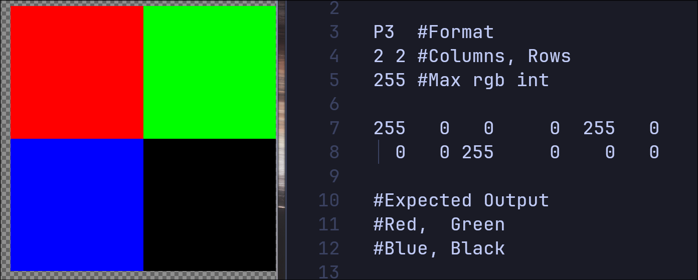
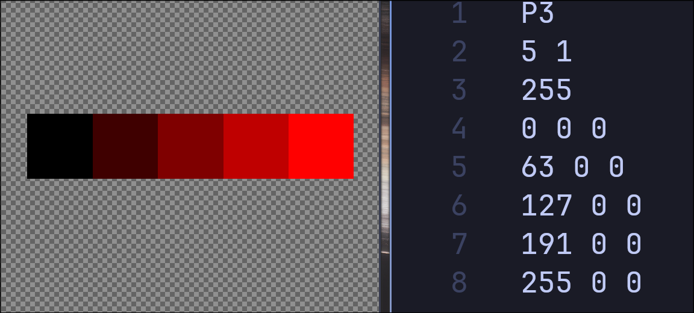
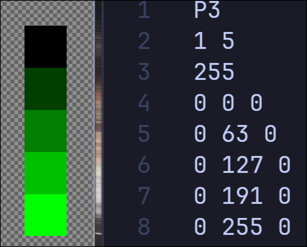
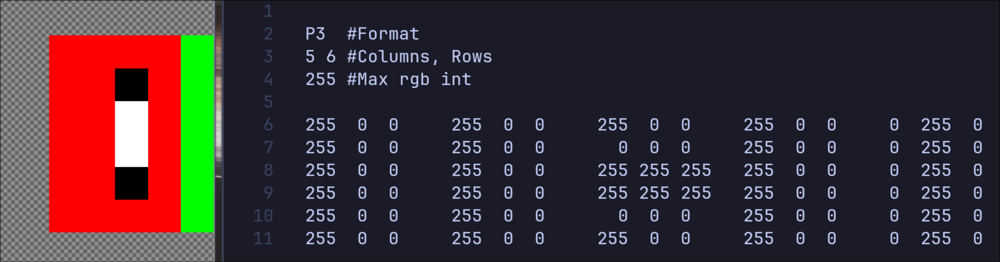
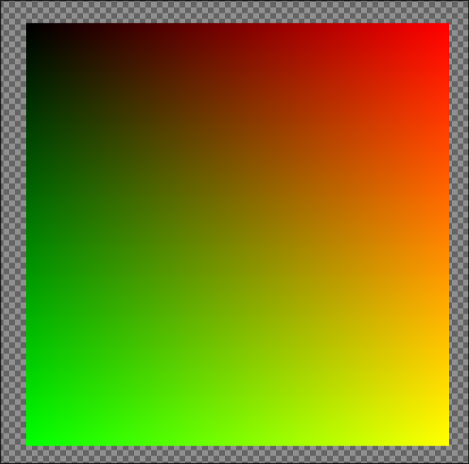
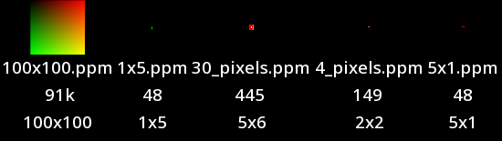
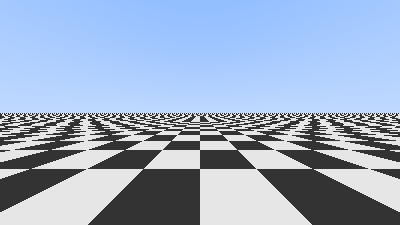

# Live Report.

| **Course**      | AUCSC 395, Directed Reading 1                                                                                                                          |
| --------------- | ------------------------------------------------------------------------------------------------------------------------------------------------------ |
| **Institution** | University of Alberta, Augustana Campus                                                                                                                |
| **Professor**   | [Dr. Thibaud Lutellier](https://apps.ualberta.ca/directory/person/lutellie) ([Google Scholar](https://scholar.google.com/citations?user=bQECG60AAAAJ)) |
| **Student**     | Johnothan Andres                                                                                                                                       |
| **Term**        | Fall 2026                                                                                                                                              |
| **Date**        | September 18, 2026                                                                                                                                     |

**Project:** Lattice-Based Sampling in Computer Graphics: Building a Renderer

---

## Contents

1. [PPM files (portable pixmaps)](#1-ppm-files-portable-pixmaps)
2. [Quantizing Colors](#2-quantizing-colors)
3. [The `inline` keyword in the `vec3` class](#3-the-inline-keyword-in-the-vec3-class)
4. [Rays and Spheres](#4-rays-and-spheres)
5. [Makefile and Folder Structuring](#5-makefile-and-folder-structuring)
6. [My Claude Usage](#6-claude-usage-stat)
7. [References](#references)

---

## 1. PPM files (portable pixmaps)

I have begun by using these files as directed in
[_Ray Tracing in One Weekend_](https://raytracing.github.io/books/RayTracingInOneWeekend.html)
to play with getting colour and shapes to render fast.

As described in PPM's own man page, these are "egregiously inefficient",
highly redundant, and not recommended for much real work. That said, they are
very easy to write, read, and analyse, which funnily enough makes them a good
starting point for learning.

### 1.1 The plain PPM format

I am starting with the "plain PPM" format. This is `P3`, the magic number that
identifies the format in use. See `man 5 ppm` for the full specification.

A good example of `P3` in use is _Ray Tracing in One Weekend_, chapter 2.1,
figure 1. Each pixel is represented by a triplet of (red, green, blue):

```
P3
5 1
255
0 0 0
63 0 0
127 0 0
191 0 0
255 0 0
```

### 1.2 `4_pixels.ppm`

Manually made this:  


### 1.3 `5x1.ppm` & `1x5.ppm`

Made these with my `create_ppm.exe`  



These two made me notice a bug in the [_Ray Tracing in One Weekend_](https://raytracing.github.io/books/RayTracingInOneWeekend.html) code section
2.3 where if the row or column is 1 or less there is a division by zero.

Obviously they're just giving quick examples, but it's fun to be running into bugs
so early.

Quick fix:

```cpp
double red = width > 1 ? double(column) / (width - 1) : 0;
double green = height > 1 ? double(row) / (height - 1) : 0;
```

### 1.4 `30_pixels.ppm`

Made this by hand:  


### 1.5 `100x100.ppm`

Made this with my `create_ppm.exe`


### 1.6 Index of every test image



This seems like a awesome way to show and compare many images so I'll likely be
using this along the project.

Produced with feh's full index mode:

```sh
feh -m -I -e NotoSans-Medium/14 -x -W 550 *.ppm -o ppm_outputs.png
```

### 1.7 Viewing these locally

See [`renders/ppm/how_to_view_ppm.txt`](renders/ppm/how_to_view_ppm.txt).
In short: open the file with `feh`, press the up arrow to zoom in until
individual pixels are visible, and press `SHIFT+A` to toggle anti-aliasing off
if the pixels look like a smooth gradient instead of hard-edged blocks.

## 2. Quantizing Colors

- [Wikipedia: Quantization](<https://en.wikipedia.org/wiki/Quantization_(signal_processing)>)

Every color we output now will be quantized to 8 bits per channel.  
I still need to add in boundary checking for this, but I now understand what  
this code now does. Even with a comment it didn't make any sense to me to start.

```cpp
void write_color(std::ostream &output, double red, double green, double blue) {
  int red_byte = int(255.999 * red);
  int green_byte = int(255.999 * green);
  int blue_byte = int(255.999 * blue);

  output << red_byte << ' ' << green_byte << ' ' << blue_byte << '\n';
}
```

### 2.1 What an 8 bit channel is

Every pixel's color is three numbers: how much red, green and blue. Each of
those numbers is called a **channel**.

A channel is stored as a whole number, and "8 bit" says how many bits it gets.
With 8 bits there are $2^8 = 256$ possible values, so a channel can be any
integer from $0$ (none of that color) to $255$ (all of it). Three channels gives
$256^3 \approx 16.7$ million colors.

Since I'm writing plain `P3`, the numbers are
stored as text, so here "8 bit" describes how many levels a channel has, not how
much space it takes on disk.

### 2.2 Why not just work in 0 to 255

The problem is that working with only integers makes blending colors, creating
gradients and doing arithmetic on colors a pain. Multiplying two half-bright
colors should give a quarter-bright one, but $127 \cdot 127 = 16129$, which
means nothing.

Thus we move to real numbers $\mathbb{R}$. But if red can be any
$x \in \mathbb{R}$, it could be $400$ or $-30$, and neither makes sense as an
amount of color. So each channel must be in the interval $[0, 1]$, where $0$ is
none of that color and $1$ is all of it.

Now multiplying two channels always gives another valid channel. If $a$ and
$b$ are both in $[0, 1]$, then multiplying $b$ by $a$ can only shrink it or
leave it the same, never grow it, because $a$ is at most $1$:

$$
0 \le a \cdot b \le b \le 1
$$

$$
0.5 \cdot 0.5 = 0.25
$$

### 2.3 Converting back to 0 to 255

The renderer works in $[0, 1]$, and only when writing the file
does it convert to the 0 to 255 scale:

$$
\text{channel} = \lfloor 255.999 \cdot x \rfloor
$$

1. Multiply by $255.999$. This stretches $[0, 1]$ to $[0, 255.999]$.
2. Floor round, which `int()` does by dropping the decimals.

For example, half red: $255.999 \cdot 0.5 = 127.9995$, and `int()` will make it
$127$.

Why $255.999$ and not $255$ or $256$? Because step 2 always rounds down:

- $256$ would split $[0, 1]$ into 256 equal slices, one per value, but $x = 1$
  gives exactly $256$, which is out of range.
- $255$ would only ever give $255$ when $x$ is exactly $1$, so the top value
  almost never gets used.
- $255.999$ keeps the slices nearly equal and still lands $x = 1$ on $255$.

---

## 3. The `inline` keyword in the `vec3` class

- [cppreference: `inline` specifier](https://en.cppreference.com/cpp/language/inline)

While working through the examples given in chapter 3 of
_Ray Tracing in One Weekend_, I came across the `vec3` class and its use of
`inline`.

`inline` is new to me, and seeing all of the definitions sitting inside the
header file felt very wrong at first. My instinct was that definitions belong
in a `.cpp` file, not a `.h` file.

After some reading, I found there is a strong reason they did this.

The idea is that functions like those on `vec3` get called extremely often in a
renderer. Declaring them `inline` inside the header encourages the compiler to
inline them at each call site, which can reduce runtime in a possibly
substantial way.

The utility functions in the example header look like this:

```cpp
inline vec3 operator+(const vec3 &u, const vec3 &v) {
  return vec3(u.e[0] + v.e[0], u.e[1] + v.e[1], u.e[2] + v.e[2]);
}

inline double dot(const vec3 &u, const vec3 &v) {
  return u.e[0] * v.e[0] + u.e[1] * v.e[1] + u.e[2] * v.e[2];
}
```

I've likely overthought this, but I was almost convinced to keep using the
inline keyword. Realistically tho I don't think I have the scale of a large
project where this would make a noticeable impact I presume. So I wont be
using it and later on if I have time after vulkan in implemented I can play
with using inline and measure the gains.

Regardless here's a reputable quote talking about it:

> **F.5: If a function is very small and time-critical, declare it `inline`**
>
> **Reason**
>
> Some optimizers are good at inlining without hints from the programmer, but
> don't rely on it. Measure! Over the last 40 years or so, we have been promised
> compilers that can inline better than humans without hints from humans. We are
> still waiting. Specifying `inline` (explicitly, or implicitly when writing
> member functions inside a class definition) encourages the compiler to do a
> better job.

Source: [C++ Core Guidelines, F.5](https://isocpp.github.io/CppCoreGuidelines/CppCoreGuidelines#f5-if-a-function-is-very-small-and-time-critical-declare-it-inline)

## 4. Rays and Spheres

### 4.1 A sphere at the origin

A sphere centered at the origin of radius $r$ is:

$$
\begin{aligned}
x^2 + y^2 + z^2 &= r^2 && \text{on the sphere's surface} \\
x^2 + y^2 + z^2 &\lt r^2 && \text{inside the sphere} \\
x^2 + y^2 + z^2 &\gt r^2 && \text{outside the sphere}
\end{aligned}
$$

### 4.2 A sphere at any center

To center the sphere at any point $(C_x, C_y, C_z)$:

$$
\begin{aligned}
(C_x - x)^2 + (C_y - y)^2 + (C_z - z)^2 &= r^2 && \text{on the sphere's surface} \\
(C_x - x)^2 + (C_y - y)^2 + (C_z - z)^2 &\lt r^2 && \text{inside the sphere} \\
(C_x - x)^2 + (C_y - y)^2 + (C_z - z)^2 &\gt r^2 && \text{outside the sphere}
\end{aligned}
$$

### 4.3 The same test with vectors

Let

$$
\begin{aligned}
\mathbf{C} &= (C_x, C_y, C_z) && \text{the center} \\
\mathbf{P} &= (x, y, z) && \text{the selected point} \\
\mathbf{M} &= \mathbf{P} - \mathbf{C} && \text{the movement vector, from center to point}
\end{aligned}
$$

Now using dot:

$$
\boxed{\;
\begin{aligned}
\mathbf{M} \cdot \mathbf{M} &= r^2 && \text{on the sphere's surface} \\
\mathbf{M} \cdot \mathbf{M} &\lt r^2 && \text{inside the sphere at some point } \mathbf{P} \\
\mathbf{M} \cdot \mathbf{M} &\gt r^2 && \text{outside the sphere at some point } \mathbf{P}
\end{aligned}
\;}
$$

### 4.4 Rays

Now we introduce a Ray, some Ray of light that travels in a straight linear
line. It starts at an origin $\mathbf{R}$ and travels in a direction
$\mathbf{d}$, which is the vector part.

We can find any point along that line of light with a simple function:

$$
\boxed{\mathbf{P}(t) = \mathbf{R} + t\,\mathbf{d}}
$$

| Exmaple                                                                 | Code |
| ----------------------------------------------------------------------- | ---- |
| **Sky:** blends white to blue by how far up each ray points.            |
|                                          |
| **Floor:** a solid floor at $y = -1$, sky wherever a ray misses it.     |
|                          |
| **Checkerboard:** the floor color flips every 1 unit along $x$ and $z$. |
|                         |

---

## 5. Makefile and Folder Structuring

Now that the codebase is getting some size, I've moved to a Makefile and a
proper folder layout. Compiling everything by hand with one long `g++` line was
getting annoying, and `make` only rebuilds the files that actually changed.

From what I can see, this is about the normal structure for a small C++
project:

```
src/       .h and .cpp files together
build/     .o files and the programs (gitignored)
renders/   output images
reports/
```

Build with `make`, run with `./build/camera_testing.exe`, and clean up with
`make clean`.

## 6. Claude Usage Stat.

I'm not sure how well I'm using agents to learn, I try to be relatively concious
about its usage, but over the last hour I've asked a lot of questions. Whether
that helps my learning as much as not asking and just struggling with the topics
I'm not sure. I thought I would share with you small usage stats over the last
hour.

| Topics                                                                                         | # of questions |
| ---------------------------------------------------------------------------------------------- | -------------- |
| C++ language (class/struct, invariants, private/const, static, .h/.cpp, helpers, float/double) | 11             |
| The camera model (position, window, world, painting, moving things)                            | 9              |
| Names, definitons, convensions, what values mean/translate too.                                | 7              |

## References

- [_Ray Tracing in One Weekend_](https://raytracing.github.io/books/RayTracingInOneWeekend.html), chapters 2.1 and 3
- [C++ Core Guidelines, F.5: If a function is very small and time-critical, declare it `inline`](https://isocpp.github.io/CppCoreGuidelines/CppCoreGuidelines#f5-if-a-function-is-very-small-and-time-critical-declare-it-inline)
- [cppreference: `inline` specifier](https://en.cppreference.com/cpp/language/inline)
- `man 5 ppm`, the plain PPM (`P3`) specification
- [Wikipedia: Sphere](https://en.wikipedia.org/wiki/Sphere)
- [Wikipedia: Quantization](<https://en.wikipedia.org/wiki/Quantization_(signal_processing)>)
- [Gnu: Make](https://www.gnu.org/software/make/manual/make.html)
